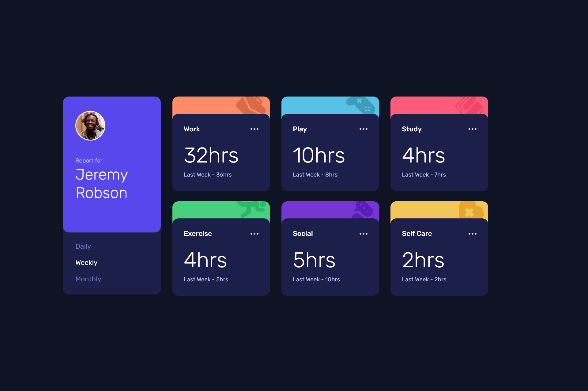

# Frontend Mentor - Time tracking dashboard solution

This is a solution to the [Time tracking dashboard challenge on Frontend Mentor](https://www.frontendmentor.io/challenges/time-tracking-dashboard-UIQ7167Jw). Frontend Mentor challenges help you improve your coding skills by building realistic projects.

## Table of contents

- [Overview](#overview)
  - [The challenge](#the-challenge)
  - [Screenshot](#screenshot)
  - [Links](#links)
- [My process](#my-process)
  - [Built with](#built-with)
- [Author](#author)
- [Acknowledgments](#acknowledgments)

## Overview

### The challenge

Users should be able to:

- ✅ View the optimal layout for the site depending on their device's screen size
- ✅ See hover states for all interactive elements on the page
- ✅ Switch between viewing Daily, Weekly, and Monthly stats

### Screenshot

### Links

- Solution URL: [GitHub](https://github.com/marcfranciss/Time-tracking-dashboard.git)
- Live Site URL: [GitHub Pages](https://marcfranciss.github.io/Time-tracking-dashboard)

## My process

### Built with

- Semantic HTML5 markup
- CSS custom properties
- Flexbox
- [React](https://reactjs.org/)
- [Vite](https://vitejs.dev/guide/)

## Author

- Website - [mackersdev.net](https://www.mackersdev.net)
- Frontend Mentor - [@marcfranciss](https://www.frontendmentor.io/profile/marcfranciss)

## Acknowledgments

Thank you for checking out this very simple project!

**Cheers!** 🍻
